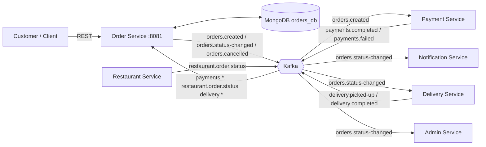
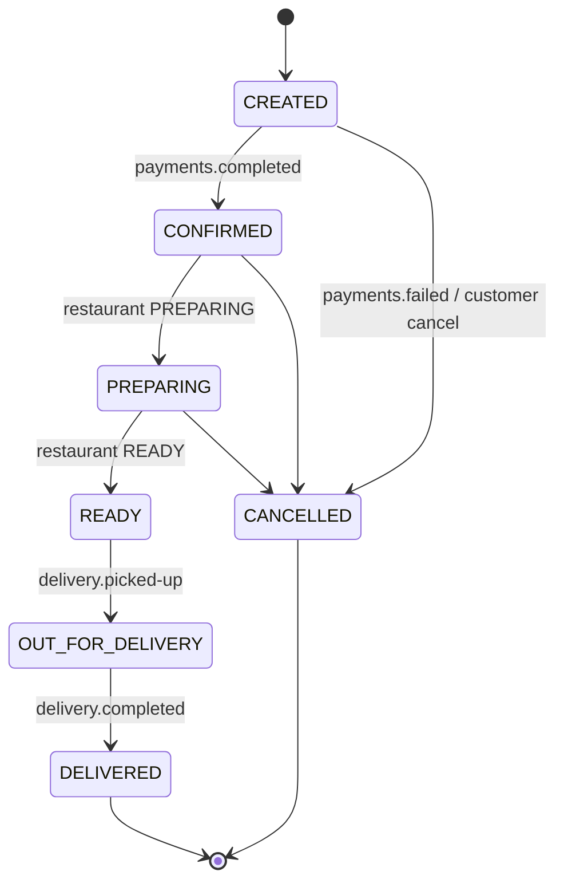
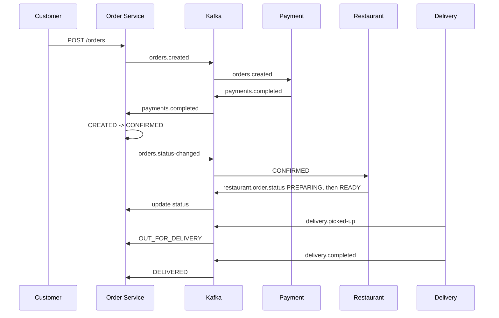
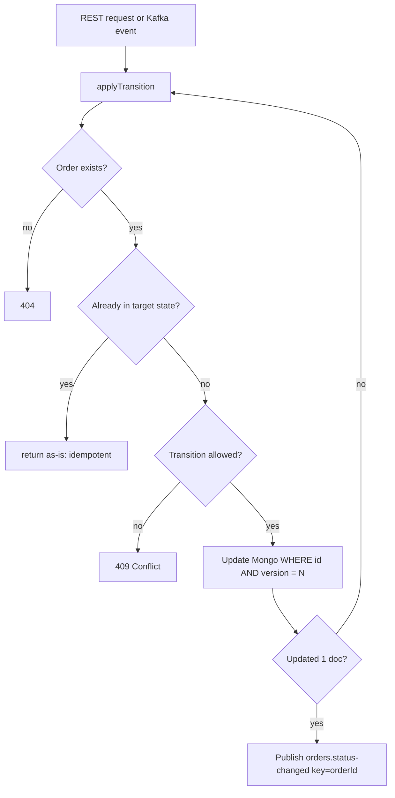

# Architecture (Order Service & Kafka)

## 1. System overview

## 2. Order state machine

Cancellation is not allowed once the order is READY (food already prepared).

## 3. Happy-path sequence

## 4. How Order Service stays correct

